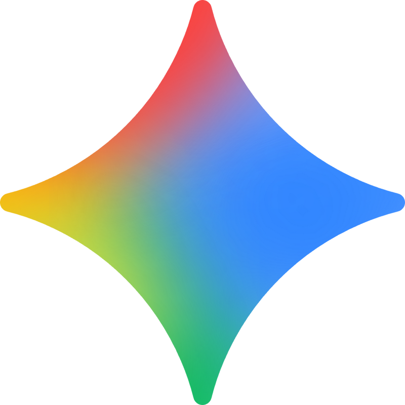

# ⚡ TokenDeck

<p align="center">
  
  &nbsp;&nbsp;&nbsp;&nbsp;&nbsp;&nbsp;&nbsp;&nbsp;&nbsp;&nbsp;&nbsp;&nbsp;
  
  &nbsp;&nbsp;&nbsp;&nbsp;&nbsp;&nbsp;&nbsp;&nbsp;&nbsp;&nbsp;&nbsp;&nbsp;
  
</p>

<p align="center">
  <b>Painel de monitoramento de uso de IA em tempo real para Codex (GPT), Claude Code e Gemini.</b><br>
  <i>Hardware de mesa (CYD 2.8" USB) + Aplicativo Desktop Moderno para Windows.</i>
</p>

<p align="center">
  
  
  
  
  
</p>

---

## 🎯 O que é o TokenDeck?

O **TokenDeck** é uma central unificada para você nunca mais ser pego de surpresa pelos limites de 5 horas ou cotas semanais das suas IAs.

Ele monitora simultaneamente os **3 principais ecossistemas de IA**:
* 🟢 **Codex / GPT (OpenAI)**: Lê os limites de 5h e semanais diretamente dos registros de sessão locais.
* 🟠 **Claude Code (Anthropic)**: Consulta a utilização da conta e rate-limits em tempo real via API oficial.
* 🟣 **Gemini (Google)**: Consulta as cotas oficiais do grupo **Gemini Models** via Antigravity CLI (`agy -p /usage --output-format json`), com tempos de renovação ajustados com precisão.

E exibe esses dados em dois lugares sincronizados:
1. 🖥️ **Desktop GUI (TokenDeck Studio)**: Um aplicativo moderno em Dark Mode (Windows 11) com barras de progresso, status dos modelos e atalhos rápidos.
2. 📟 **Tela de Mesa CYD 2.8" (ESP32)**: Conectada diretamente ao PC via cabo de dados USB (COM4 / CH340), sem necessidade de Wi-Fi ou Bluetooth.

---

## 🔄 Como Funciona a Arquitetura

```text
    [ OpenAI Codex ]       [ Anthropic Claude ]       [ Google Gemini ]
   (Arquivos de Sessão)     (Credenciais / API)       (Antigravity CLI)
            │                       │                        │
            └───────────────────────┼────────────────────────┘
                                    │
                                    ▼
                    ┌───────────────────────────────┐
                    │     TokenDeck Bridge Python   │
                    │  (usage_serial_bridge_windows)│
                    └───────────────┬───────────────┘
                                    │
                 ┌──────────────────┴──────────────────┐
                 ▼                                     ▼
      ┌─────────────────────┐               ┌─────────────────────┐
      │  Tela CYD 2.8" ESP32│               │  TokenDeck Desktop  │
      │  (USB Serial COM4)  │               │   (Studio GUI App)  │
      │  Alterna automática-│               │  Visão simultânea   │
      │  mente com atividade│               │  dos 3 modelos      │
      └─────────────────────┘               └─────────────────────┘
```

### ⚡ Alternância Automática de Tela
Quando você envia uma mensagem para qualquer assistente no computador, o TokenDeck detecta a atividade e **muda a tela da CYD automaticamente** para a IA correspondente:
* Mensagem no Codex ➡️ Tela do Codex / GPT
* Mensagem no Claude ➡️ Tela do Claude
* Mensagem no Gemini (`agy`) ➡️ Tela do Gemini

---

## 🚀 Como Usar no Windows

### 1. Pré-requisitos
* Windows 10 ou 11
* Python 3.11+
* Antigravity CLI (`agy`) logado para métricas do Gemini
* Cabo USB conectado à porta CH340 da sua CYD (normalmente **COM4**)

### 2. Configuração Inicial (Única vez)
Abra o PowerShell na pasta do projeto:

```powershell
# Criação e ativação do ambiente virtual
python -m venv daemon\.venv
& "daemon\.venv\Scripts\python.exe" -m pip install -r daemon\requirements-windows.txt
```

---

## 🎮 Comandos e Atalhos Rápidos

Todos os atalhos podem ser executados no terminal ou com **2 cliques** direto pelo Windows Explorer:

| Ação | Comando PowerShell | Executável (.cmd) | Descrição |
| :--- | :--- | :--- | :--- |
| **Abrir App Desktop** | `.\tokendeck-gui` | `tokendeck.cmd` | Abre o dashboard visual com todos os 3 modelos e controles. |
| **Iniciar Bridge USB** | `.\tokendeck-server` | `tokendeck-server.cmd` | Inicia o envio de métricas a cada 5s para a tela física CYD. |
| **Gravar Firmware** | `.\tokendeck-record` | `tokendeck-record.cmd` | Compila e grava o firmware na placa CYD via PlatformIO. |

> 💡 **Dica:** O próprio aplicativo desktop possui botões para **Iniciar/Parar a Bridge** e **Gravar o Firmware** com um clique, liberando a porta COM4 automaticamente antes de gravar!

---

## 🖥️ Telas do TokenDeck

| Tela CYD 2.8" | TokenDeck Desktop Studio |
| :---: | :---: |
|  | 3 cards lado a lado com OpenAI, Claude e Gemini |
| Auto-alternância física na mesa | Visual Dark Mode nativo com barras de progresso |

---

## 🛠️ Hardware Suportado

* **Principal (Recomendado):**
  - **CYD 2.8-inch / ESP32-2432S028R** (Conexão direta USB CH340 no Windows).
* **Hardware Alternativo / BLE (Legado):**
  - Waveshare ESP32-S3-Touch-AMOLED (2.16", 1.8", 2.06")
  - Waveshare ESP32-C6-Touch-AMOLED-2.16
  - Waveshare ESP32-S3-Touch-LCD (1.54", 4.0")

---

## 🔒 Privacidade e Segurança
O TokenDeck lê exclusivamente marcadores de limites de taxa (*rate limits*) e timestamps de arquivos de sessão locais. **Ele nunca lê, armazena ou transmite seus prompts, conversas ou chaves privadas.**
