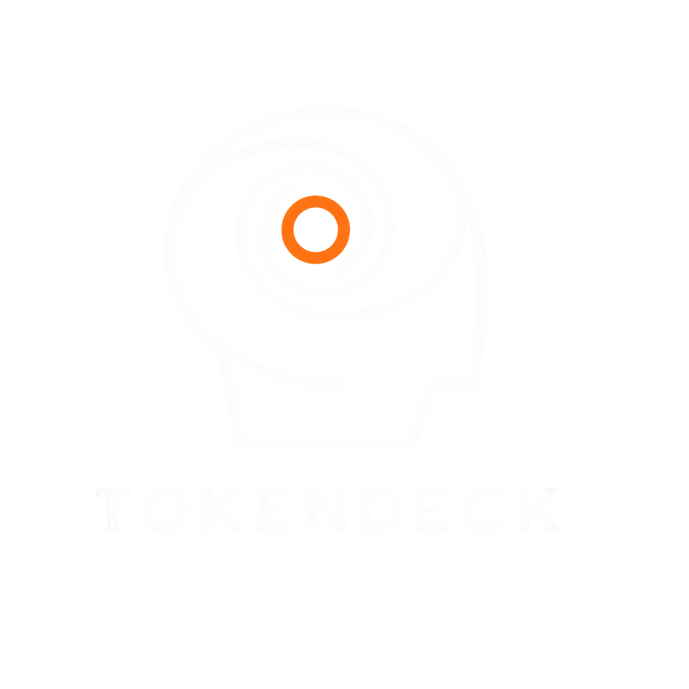
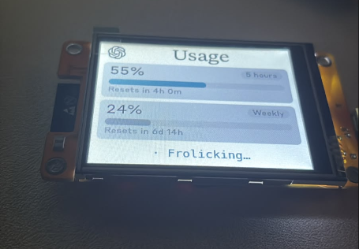
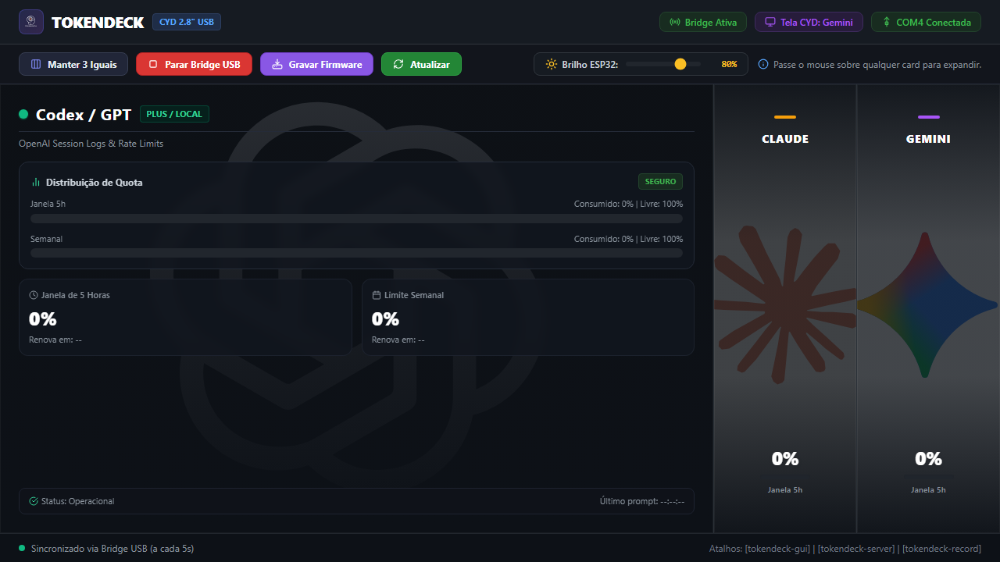

# TokenDeck

<p align="center">
  
</p>

<p align="center">
  <b>Real-time AI quota and rate-limit monitor for Codex (GPT), Claude Code, and Gemini.</b><br>
  <i>Desktop hardware monitor (CYD 2.8" USB) + Modern Windows Studio Application.</i>
</p>

<p align="center">
  
  
  
  
  
</p>

---

## What is TokenDeck?

**TokenDeck** is a unified dashboard and hardware display hub designed to monitor 5-hour quota windows, weekly limits, and operational status across major AI coding assistants.

It tracks all 3 primary developer ecosystems in real time:
* **Codex / GPT (OpenAI)**: Reads 5-hour and weekly usage limits directly from local session logs.
* **Claude Code (Anthropic)**: Queries account rate limits and utilization in real time via the official API.
* **Gemini (Google)**: Fetches official Gemini Models group quota via Antigravity CLI (`agy -p /usage --output-format json`) with high-precision reset countdowns.

TokenDeck presents this telemetry through two synchronized environments:
1. **Desktop GUI (TokenDeck Studio)**: GPU-accelerated Dark Mode desktop application featuring smooth transitions, dynamic hover focus mode, 1:1:1 split mode, display brightness control, and integrated bridge management.
2. **Desk Hardware Monitor (CYD 2.8" ESP32)**: Connected directly via USB serial (COM4 / CH340), featuring intelligent screen switching and non-volatile (NVS) flash memory brightness persistence.

---

## Visual Overview

<div align="center">
  <table>
    <tr>
      <th align="center">Physical Desk Display (CYD 2.8" ESP32)</th>
      <th align="center">Desktop Application (TokenDeck Studio)</th>
    </tr>
    <tr>
      <td align="center" width="45%">
        
      </td>
      <td align="center" width="55%">
        
      </td>
    </tr>
  </table>
</div>

---

## Key Features

* **Responsive Edge-to-Edge Layout**: 3 integrated panels positioned seamlessly side-by-side with 1px hairline dividers.
* **Dynamic Hover Focus Mode**: Hovering over any card expands it with detailed quota distribution charts (5-hour and weekly windows), operational status, and activity timestamps.
* **Split View Mode (1:1:1)**: "Keep 3 Equal" button locks all 3 cards in uniform width simultaneously.
* **Real-time ESP32 Brightness Control**: Dedicated toolbar slider with direct serial communication (`BRIGHT:<0-100>`) and automatic persistence in ESP32 NVS memory.
* **Automatic Screen Switching**: The CYD hardware display detects active AI conversations on the computer and switches screens instantly to match the active assistant.
* **Vector Iconography**: 100% vector-based UI using Lucide vector icons and official branding.
* **Integrated Management**: One-click controls to Start/Stop the USB Serial Bridge, Flash Firmware (with automatic COM port release), and Refresh Metrics.

---

## System Architecture

```text
    [ OpenAI Codex ]       [ Anthropic Claude ]       [ Google Gemini ]
   (Local Session Logs)    (Credentials / API)        (Antigravity CLI)
            │                       │                        │
            └───────────────────────┼────────────────────────┘
                                    │
                                    ▼
                    ┌───────────────────────────────┐
                    │     TokenDeck Python Bridge   │
                    │  (usage_serial_bridge_windows)│
                    └───────────────┬───────────────┘
                                    │
                 ┌──────────────────┴──────────────────┐
                 ▼                                     ▼
      ┌─────────────────────┐               ┌─────────────────────┐
      │  CYD 2.8" ESP32 LCD │               │  TokenDeck Desktop  │
      │  (USB Serial COM4)  │               │   (Studio GUI App)  │
      │  Auto-switches with │               │  Simultaneous view  │
      │  active assistant   │               │  of all 3 models    │
      └─────────────────────┘               └─────────────────────┘
```

---

## Getting Started on Windows

### 1. Prerequisites
* Windows 10 or 11
* Python 3.11+
* Antigravity CLI (`agy`) authenticated for Gemini metrics
* USB data cable connected to the CH340 port on the CYD (typically **COM4**)

### 2. Initial Setup
Open PowerShell in the project root directory:

```powershell
# Create virtual environment and install dependencies
python -m venv daemon\.venv
& "daemon\.venv\Scripts\python.exe" -m pip install -r daemon\requirements-windows.txt
```

---

## Commands and Quick Shortcuts

Launch tools directly from PowerShell, via the Desktop shortcut with the official icon, or using `.cmd` scripts:

| Action | Shortcut / Executable | PowerShell Command | Description |
| :--- | :--- | :--- | :--- |
| **Open Desktop App (Icon)** | `TokenDeck.lnk` (Desktop) | `.\tokendeck` | Launches the Studio dashboard silently without terminal windows. |
| **Start USB Bridge** | `tokendeck-server.cmd` | `.\tokendeck-server` | Starts the 5-second serial telemetry bridge to the CYD display. |
| **Flash Firmware** | `tokendeck-record.cmd` | `.\tokendeck-record` | Compiles and flashes the firmware to the CYD board via PlatformIO. |
| **Recreate Shortcuts** | `scripts\create-shortcut.ps1` | `.\scripts\create-shortcut.ps1` | Generates or updates the Desktop and project shortcuts with the icon. |

---

## Supported Hardware

* **Primary (Recommended):**
  - **CYD 2.8-inch / ESP32-2432S028R** (Direct USB CH340 connection on Windows). This is the only board this repository builds firmware for today (`pio run -e cyd_28`).
* **Retired (BLE, source removed):**
  - Waveshare ESP32-S3-Touch-AMOLED (2.16", 1.8", 2.06"), ESP32-C6-Touch-AMOLED-2.16, ESP32-S3-Touch-LCD (1.54", 4.0")
  - Their firmware source was removed when the project pivoted to CYD + USB serial; it's recoverable from git history (pre-rebrand commits) if you need to resurrect a port. The Python daemons still speak the legacy BLE protocol for anyone with a previously-flashed board — see [daemon/README-windows.md](daemon/README-windows.md).

---

## Automated Test Suite

The test suite validates the monitoring daemons, serial telemetry protocol, and state persistence:

```powershell
& "daemon\.venv\Scripts\python.exe" -m pytest daemon\tests
```

---

## Privacy and Security

TokenDeck strictly reads rate-limit quotas and timestamps from local session logs and APIs. **It never reads, stores, or transmits prompts, conversation contents, or private keys.**
