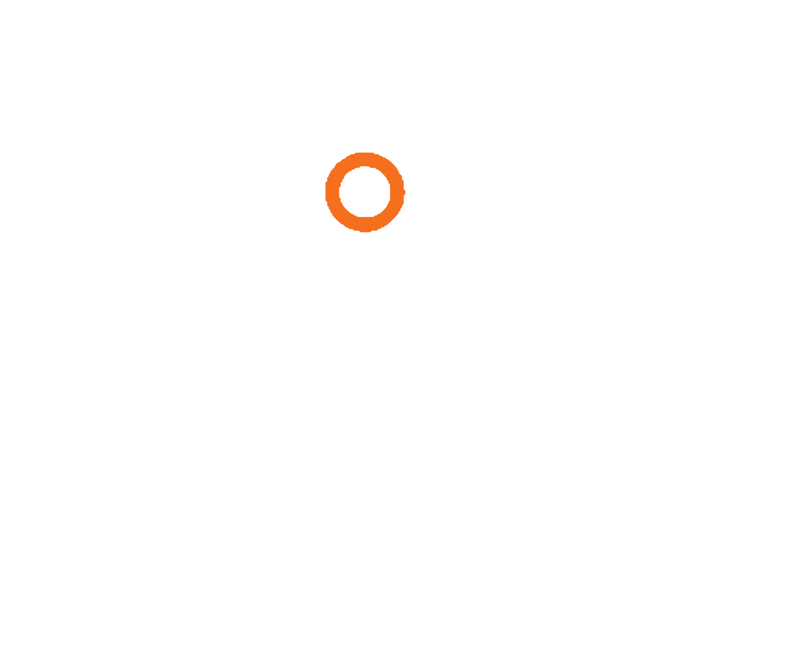

# TokenDeck

<p align="center">
  
</p>

<p align="center">
  <b>Painel de monitoramento de uso de IA em tempo real para Codex (GPT), Claude Code e Gemini.</b><br>
  <i>Hardware de mesa (CYD 2.8" USB) + Aplicativo Desktop Moderno para Windows.</i>
</p>

<p align="center">
  
  
  
  
  
</p>

---

## O que é o TokenDeck?

O **TokenDeck** é uma central unificada para acompanhar os limites de 5 horas e cotas semanais dos principais assistentes de IA de desenvolvimento.

Ele monitora simultaneamente os 3 principais ecossistemas:
* **Codex / GPT (OpenAI)**: Lê os limites de janela de 5h e semanais diretamente dos registros de sessão locais.
* **Claude Code (Anthropic)**: Consulta a utilização da conta e limites de requisição em tempo real via API oficial.
* **Gemini (Google)**: Consulta as cotas oficiais do grupo Gemini Models via Antigravity CLI (`agy -p /usage --output-format json`), com tempos de renovação ajustados com precisão.

E exibe esses dados em dois ambientes integrados:
1. **Desktop GUI (TokenDeck Studio)**: Interface moderna em Dark Mode acelerada por GPU, com transições suaves, modo foco dinâmico, modo 1:1:1, controle de brilho e atalhos de gerenciamento da bridge.
2. **Display de Mesa CYD 2.8" (ESP32)**: Conectado diretamente via cabo de dados USB (COM4 / CH340), com alternância inteligente de tela e brilho ajustável salvo na memória NVS.

---

## Recursos Principais

* **Layout Edge-to-Edge Responsivo**: 3 painéis integrados lado a lado cobrindo toda a extensão da janela com separadores limpos de 1px.
* **Modo Foco Dinâmico**: Ao passar o mouse sobre qualquer card, ele se expande exibindo gráficos detalhados de distribuição de quota (janela 5h e semanal), status operacional e registros de atividade.
* **Modo Dividido (1:1:1)**: Botão "Manter 3 Iguais" para fixar as 3 abas abertas simultaneamente em largura uniforme.
* **Controle de Brilho ESP32 em Tempo Real**: Slider dedicado na barra superior com comunicação serial direta (`BRIGHT:<0-100>`) e persistência automática na memória flash (NVS) do display CYD.
* **Alternância Automática de Tela**: A tela física do CYD detecta a IA em uso no computador e muda a exibição instantaneamente para o modelo ativo.
* **Iconografia Vetorial**: Interface 100% vetorial utilizando Lucide Icons e logos oficiais.
* **Gerenciamento Integrado**: Botões com um clique para Iniciar/Parar a Bridge USB, Gravar Firmware (com liberação automática de porta COM) e Atualizar Métricas.

---

## Arquitetura do Sistema

```text
    [ OpenAI Codex ]       [ Anthropic Claude ]       [ Google Gemini ]
   (Arquivos de Sessão)     (Credenciais / API)       (Antigravity CLI)
            │                       │                        │
            └───────────────────────┼────────────────────────┘
                                    │
                                    ▼
                    ┌───────────────────────────────┐
                    │     TokenDeck Bridge Python   │
                    │  (usage_serial_bridge_windows)│
                    └───────────────┬───────────────┘
                                    │
                 ┌──────────────────┴──────────────────┐
                 ▼                                     ▼
      ┌─────────────────────┐               ┌─────────────────────┐
      │  Tela CYD 2.8" ESP32│               │  TokenDeck Desktop  │
      │  (USB Serial COM4)  │               │   (Studio GUI App)  │
      │  Alterna automatica-│               │  Visão simultânea   │
      │  mente com atividade│               │  dos 3 modelos      │
      └─────────────────────┘               └─────────────────────┘
```

---

## Como Usar no Windows

### 1. Pré-requisitos
* Windows 10 ou 11
* Python 3.11+
* Antigravity CLI (`agy`) autenticado para métricas do Gemini
* Cabo USB conectado à porta CH340 da sua CYD (normalmente **COM4**)

### 2. Configuração Inicial
Abra o PowerShell na pasta raiz do projeto:

```powershell
# Criação do ambiente virtual e instalação de dependências
python -m venv daemon\.venv
& "daemon\.venv\Scripts\python.exe" -m pip install -r daemon\requirements-windows.txt
```

---

## Comandos e Atalhos Rápidos

Você pode iniciar as ferramentas diretamente pelo PowerShell ou com dois cliques nos arquivos `.cmd` pelo Windows Explorer:

| Ação | Comando PowerShell | Executável (.cmd) | Descrição |
| :--- | :--- | :--- | :--- |
| **Abrir App Desktop** | `.\tokendeck-gui` | `tokendeck.cmd` | Inicia o painel visual com todos os 3 modelos, controle de brilho e bridge. |
| **Iniciar Bridge USB** | `.\tokendeck-server` | `tokendeck-server.cmd` | Inicia o envio de métricas a cada 5s para o display físico CYD. |
| **Gravar Firmware** | `.\tokendeck-record` | `tokendeck-record.cmd` | Compila e grava o firmware na placa CYD via PlatformIO. |

---

## Hardware Suportado

* **Principal (Recomendado):**
  - **CYD 2.8-inch / ESP32-2432S028R** (Conexão direta USB CH340 no Windows).
* **Hardware Alternativo / BLE (Legado):**
  - Waveshare ESP32-S3-Touch-AMOLED (2.16", 1.8", 2.06")
  - Waveshare ESP32-C6-Touch-AMOLED-2.16
  - Waveshare ESP32-S3-Touch-LCD (1.54", 4.0")

---

## Testes Automatizados

A suíte de testes cobre o daemon de monitoramento, integração serial e persistência de estado:

```powershell
& "daemon\.venv\Scripts\python.exe" -m pytest daemon\tests
```

---

## Privacidade e Segurança

O TokenDeck lê exclusivamente marcadores de limites de taxa (*rate limits*) e registros de data e hora de arquivos de sessão locais. **Ele nunca lê, armazena ou transmite seus prompts, conversas ou chaves privadas.**
